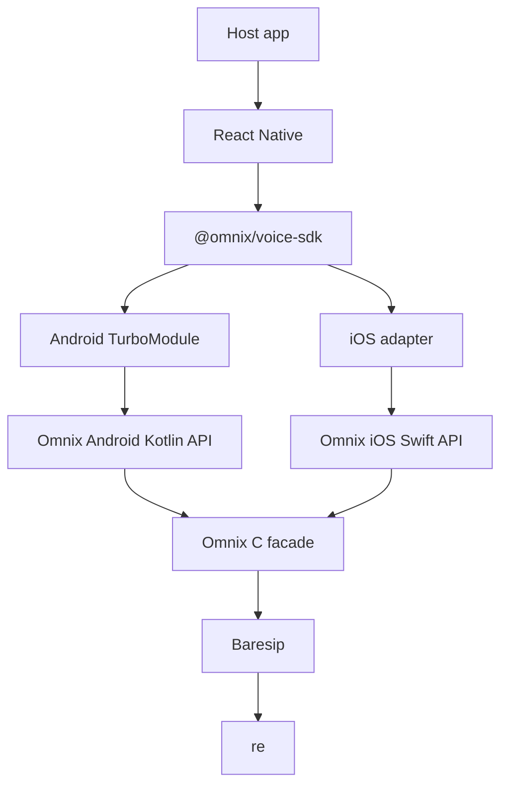

# Architecture

Frozen decisions are in [Issue #1](https://github.com/fiecar/omnix-voice-sdk/issues/1).
This page describes the tree as it is, not a future design.

## Layers

Host apps stop at the Omnix API. Baresip and re stay inside the C facade.

The iOS React Native adapter is not in the tree yet (SDK-049).
The iOS Swift facade and Objective-C bridge sources are IMPLEMENTED.
Packaging them as `OmnixVoiceSDK.xcframework` is BLOCKED (SDK-043).

## Status of each box

| Box | Status |
|-----|--------|
| `@omnix/voice-sdk` TypeScript facade | IMPLEMENTED. Jest uses a mock, not a device. |
| Android TurboModule | IMPLEMENTED in source. Compiling it inside a React Native Android host is NOT YET VERIFIED. |
| Android Kotlin API and JNI | IMPLEMENTED |
| iOS Swift API | IMPLEMENTED as source |
| iOS XCFramework | BLOCKED |
| C facade | IMPLEMENTED. Host unit tests run in Linux CI via `ctest` (`tests/native`). |
| Real SIP | NOT AVAILABLE |
| Physical iPhone | NOT AVAILABLE |

## What does not cross the public boundary

Public headers, Kotlin, Swift, and TypeScript do not expose `struct ua`, `struct call`, `struct account`, JNI types, or Objective-C bridge types.
`scripts/check-api-leakage.ps1` and `.sh` fail the build on those leaks.

`transferCall` / `omnix_call_transfer_blind` is part of the frozen API and returns `NOT_SUPPORTED` until blind transfer is delivered (SDK-024). Attended transfer is POST-MVP and has no public API.

## MVP call scope

Incoming calls require a live process, an initialized and registered SDK, and a foreground app.
Killed-app, suspended-app, CallKit, PushKit, FCM, and ConnectionService are POST-MVP and are not in this SDK.

## Media

Signaling is TLS. `verifyCert` defaults to true.
Media encryption defaults to DTLS-SRTP. `enableSrtp: false` still encrypts and logs a warning.
G.711 (PCMU/PCMA) is the mandatory codec. The public codec list includes `opus`, and names that are not compiled in are ignored. The Opus module (SDK-067) is not in this tree.
STUN can be set with `stunServer`. TURN and full ICE are POST-MVP. Live NAT behavior is NOT YET VERIFIED.
